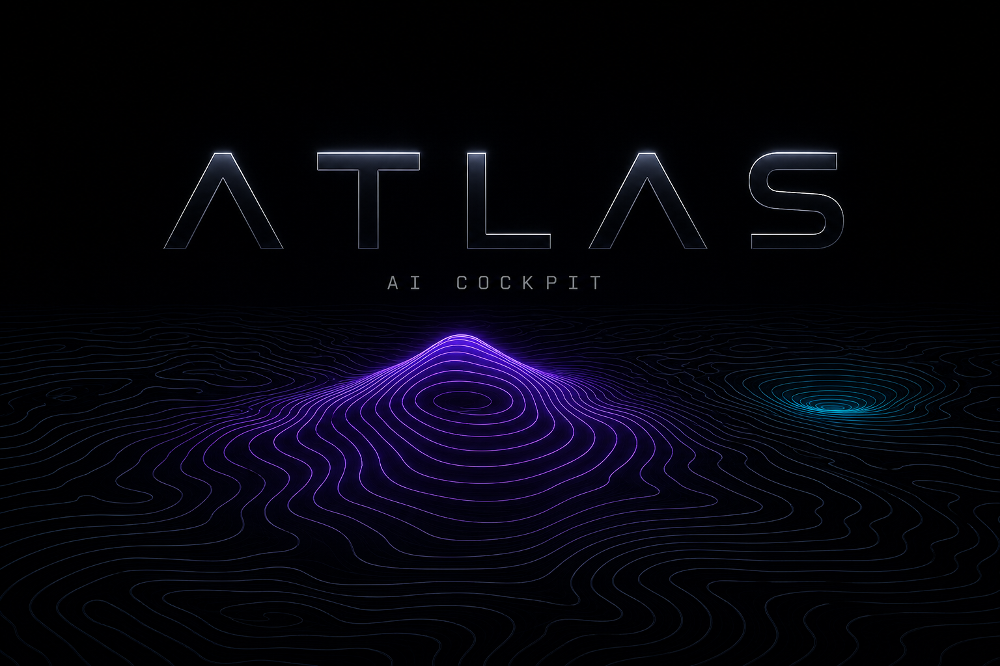
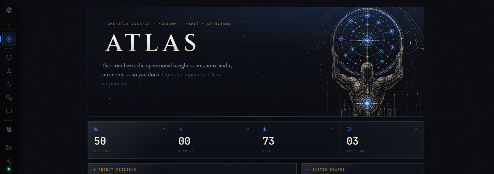
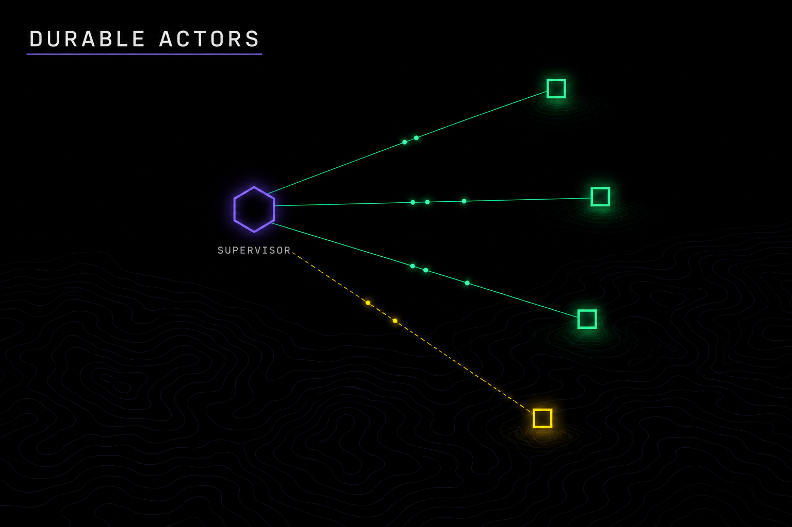
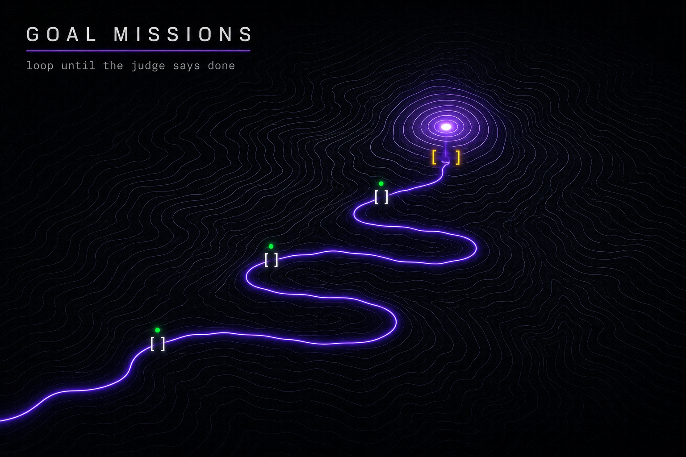
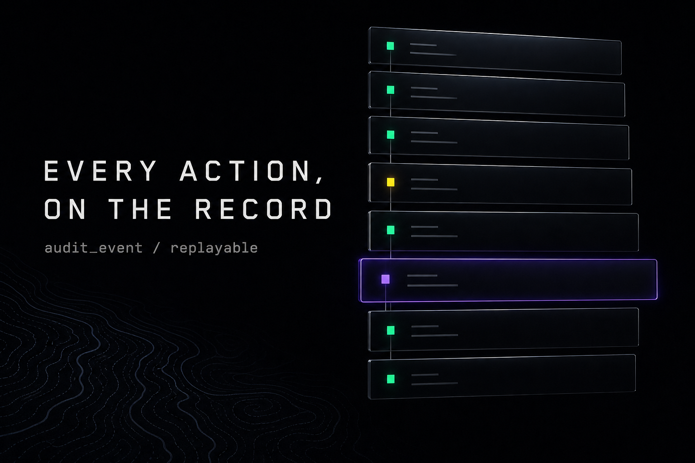
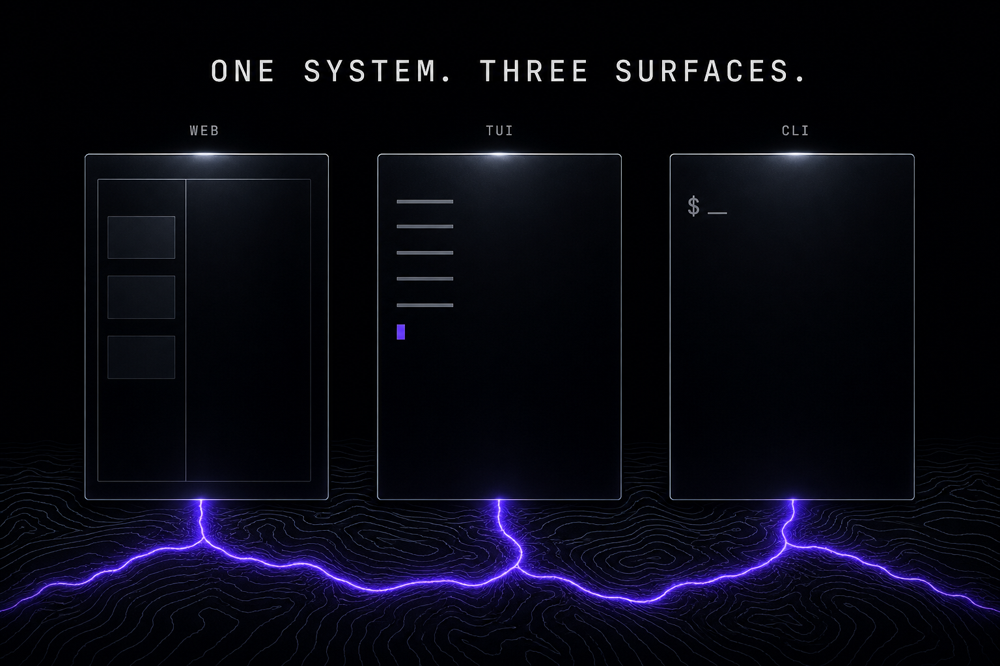
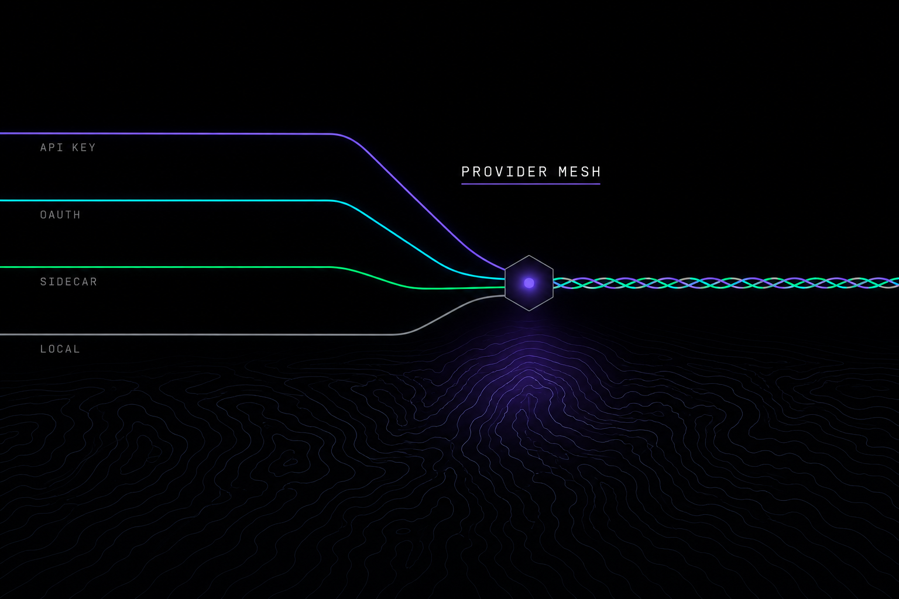
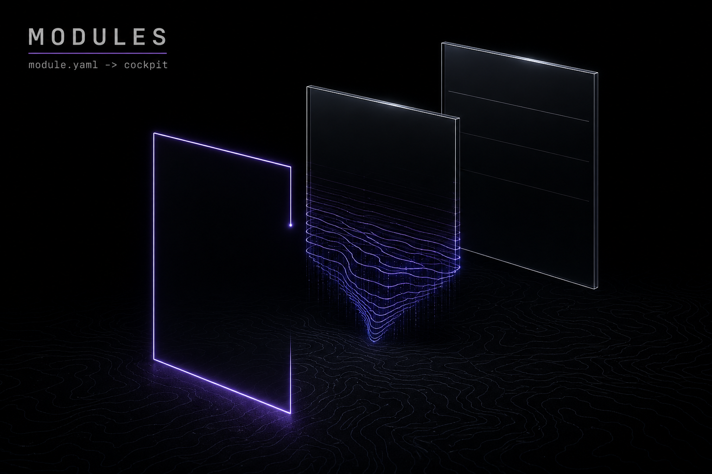
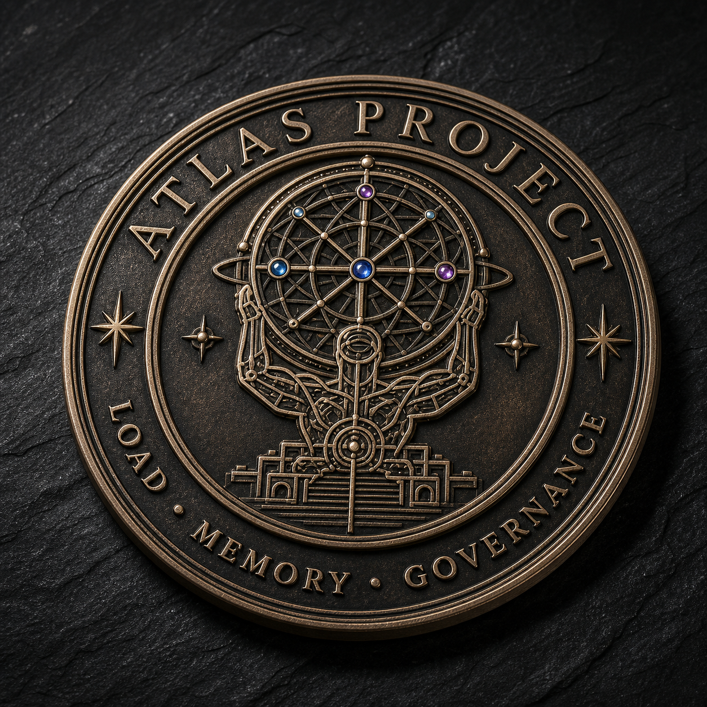

<p align="center">
  
</p>

<p align="center">
  <strong>An auditable AI operator cockpit for developers and power users.</strong><br>
  One runtime for missions, agents, tools, knowledge, approvals, and operational state.
</p>

<p align="center">
  <a href="https://www.npmjs.com/package/@systemsl2/atlas"></a>
  <a href="LICENSE"></a>
  
  <a href="../../actions/workflows/atlas-ci.yml"></a>
</p>

<p align="center">
  <a href="#installation">Install</a> ·
  <a href="docs/architecture/OVERVIEW.md">Architecture</a> ·
  <a href="docs/operations/INSTALL.md">Operations</a> ·
  <a href="docs/known-failures.md">Known limitations</a> ·
  <a href="SECURITY.md">Security</a>
</p>

```powershell
npm install --global @systemsl2/atlas
```

> **Open research preview.** The repository and Windows x64 npm package are public.
> Independent clean-machine feedback is welcome; do not use the preview with
> sensitive production data.

---

## What ATLAS is

ATLAS turns an evolved Hermes foundation into an L2-owned operator runtime. It joins
agent execution with an audit ledger, mission and run state, approval-gated tools,
persistent knowledge, provider routing, and a WebUI cockpit. The product is designed
so every meaningful action can be traced from intent to tool call, output, and
verification.

<p align="center">
  
</p>

## Capabilities

<table>
  <tr>
    <td width="33%" valign="top">
      
      <br><strong>Durable actors</strong><br>
      Persistent subagent supervision — spawn is idempotent, terminal transitions are
      monotonic, and detached results are delivered exactly once across crashes.
    </td>
    <td width="33%" valign="top">
      
      <br><strong>Goal-driven missions</strong><br>
      A Command Center of focus, goals, and tasks. Autonomous <code>/goal</code> loops
      run to judge-gated completion with pause, resume, and mark-concluded.
    </td>
    <td width="33%" valign="top">
      
      <br><strong>Audit ledger</strong><br>
      Structured missions and runs, tool approvals, artifacts, and append-oriented
      operational evidence — every action on the record.
    </td>
  </tr>
  <tr>
    <td width="33%" valign="top">
      
      <br><strong>One system, three surfaces</strong><br>
      A chat-first WebUI cockpit, a terminal UI, and a scriptable CLI over the same
      runtime and the same audited state.
    </td>
    <td width="33%" valign="top">
      
      <br><strong>Provider mesh</strong><br>
      Route across API-key, OAuth, local, and sidecar model providers. Optional Claude
      and Codex SDK runtimes install and uninstall on demand.
    </td>
    <td width="33%" valign="top">
      
      <br><strong>Extensible modules</strong><br>
      Bundled modules ship with releases; operator and agent modules live under
      <code>ATLAS_HOME/modules</code> and survive updates.
    </td>
  </tr>
</table>

- **Persistent knowledge** — wiki/codex ingestion, provenance, a queryable knowledge
  graph the agent can read and write, and configurable graph scopes.
- **Native direction** — the gateway and new infrastructure are Rust-first; the Hermes
  plugin surface and LLM adapters remain Python where that boundary is useful.

## Installation

Windows x64 preview:

```powershell
npm install --global @systemsl2/atlas
```

The npm launcher installs a verified platform release, then delegates normal commands
to it. Application versions live outside the source repository and outside live
operator state. `atlas update` replaces the launcher/runtime version while preserving
the database, configuration, credentials, wiki, logs, and user modules.

The published package contains an embedded Python runtime, the Rust gateway, terminal
UI, compiled WebUI, runtime services, and bundled modules. Node.js 20+ and npm are the
only prerequisites; Git, Python, Go, and Rust are not required. Source developers can
still use the PowerShell bootstrap:

```powershell
$f="$env:TEMP\atlas-install.ps1"; (irm https://raw.githubusercontent.com/L2-ootm/L2-ATLAS-PROJECT/main/install/install.ps1) | Set-Content -Path $f -Encoding UTF8; powershell -ExecutionPolicy Bypass -File $f
```

The PowerShell URL is public and now uses the same npm release path by default. See
[the installation guide](docs/operations/INSTALL.md) for source, release, update,
rollback, and clean-machine details.

## First run

```powershell
atlas up --services gateway,cockpit
atlas doctor
atlas
```

`atlas up` starts the local gateway and cockpit. `atlas` opens the terminal surface.
Mock Mode supports the core demo path without a provider API key.

## Update model

```text
npm launcher          npm global prefix
immutable releases    OS application-data/atlas/versions/<version>
active pointer        OS application-data/atlas/current
operator state        ~/.atlas (or ATLAS_HOME)
user modules          ~/.atlas/modules
```

Updates never target this development checkout. A failed download, checksum, or
entrypoint validation cannot activate the new version; the previous verified version
remains available to `atlas rollback`.

## Repository map

| Area | Purpose |
|---|---|
| `foundation/atlas-hermes/` | Hermes-derived ATLAS foundation and divergence record |
| `services/agent-runtime/` | Runtime orchestration and CLI |
| `native/atlas-core-rs/` | Rust gateway and native infrastructure |
| `services/web-ui-react/` | WebUI operator cockpit |
| `services/atlas-tui/` | Current Go terminal surface |
| `services/atlas-terminal/` | Next terminal surface under gated evaluation |
| `packages/atlas-cli/` | npm installer, updater, rollback, and runtime launcher |
| `modules/` | Modules bundled with ATLAS releases |
| `docs/` | Architecture, operations, decisions, verification, and release material |

## Trust and project status

ATLAS is intentionally honest about unfinished work. The Windows x64 npm packages are
published and passed an anonymous-registry isolated install UAT; the repository is
public. Independent clean-Windows and future cross-version update/rollback UAT remain
recommended. Repository cleanup and the configured full-history secret scan are
complete. Release status is tracked in
[`docs/release/RELEASE_CHECKLIST.md`](docs/release/RELEASE_CHECKLIST.md); internal
planning/session state is deliberately excluded from the public repository.

The foundation is vendored and evolved in place rather than treated as a black-box
dependency. Provenance and changes are documented in
[`foundation/ATTRIBUTION.md`](foundation/ATTRIBUTION.md) and
[`foundation/DIVERGENCE_LOG.md`](foundation/DIVERGENCE_LOG.md).

## Contributing

Read [CONTRIBUTING.md](CONTRIBUTING.md), the [Code of Conduct](CODE_OF_CONDUCT.md),
and [CLA.md](CLA.md) before opening a contribution. Security issues should follow the
private process in [SECURITY.md](SECURITY.md).

## License

ATLAS is available under the [MIT License](LICENSE). Third-party licenses and derived
code attribution are documented in [THIRD_PARTY_LICENSES.md](THIRD_PARTY_LICENSES.md)
and [ATTRIBUTION.md](ATTRIBUTION.md).

<p align="center">
  
  <br>
  <sub><strong>FOR THOSE WHO BUILD WHAT ENDURES.</strong></sub>
</p>
