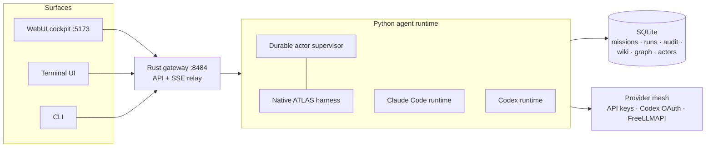

<div align="center">

# ATLAS

**An AI cockpit for the agentic era of software development.**

One control surface for directing AI agents — missions, runtimes, tools,
context, execution, and review — with every action audited.

[](LICENSE)
[](#honesty-first)
[](docs/operations/INSTALL.md)
[](docs/operations/INSTALL.md)
[](docs/operations/INSTALL.md)

<!-- media: hero banner -->


</div>

---

The next era of software development is not only about generating code. It is
about directing intelligent systems with clarity, visibility, and control.
ATLAS is where that direction happens: a cockpit built by L2 Systems where
developers plan, launch, observe, and review agentic work instead of watching
a scrollback buffer.

## What ATLAS gives you

- **Mission control** — create missions, run them through the runtime of your
  choice, and follow live SSE audit streams as they execute. Long-horizon
  `/goal` missions loop until an LLM judge confirms the stop condition is met.
- **Three runtimes, one cockpit** — the native ATLAS runtime (evolved from the
  Hermes agent foundation), your local **Claude Code** session, or **OpenAI
  Codex** via its official SDK and your existing login. Switch per-turn from a
  dropdown or `/agent`.
- **Durable actors** — detached subagent workers with a crash-safe supervisor:
  idempotent state machine, completion inbox, heartbeats, orphan recovery, and
  a live orchestration rail in the UI.
- **Audit-first by construction** — every action is an `audit_event` in
  SQLite. The Ledger is a cross-run forensic explorer; runs, tool calls,
  deltas, approvals, and judgements are all replayable evidence.
- **Persistent knowledge** — artifacts, an LLM Wiki (Codex) with provenance
  and FTS5 search, and a knowledge graph the agent can query read-only through
  the `atlas_graph` tool.
- **Extensible by modules** — a `module.yaml` manifest contributes slash
  commands and schema-driven cockpit pages. `atlas module create` scaffolds,
  syncs, and activates in one step — the agent can extend its own cockpit.
- **Provider mesh** — bring an API key, import Codex OAuth, or run the
  FreeLLMAPI sidecar; per-role model routing (chat, actors, curator, judge)
  with explicit privacy warnings where they apply.
- **Zero-credential trial** — Mock Mode runs the full mission → run → audit →
  artifact loop with no API key configured.

<!-- media: cockpit screenshot strip -->
<!--  -->

## Surfaces

| Surface | What it is |
|---|---|
| **WebUI cockpit** (`:5173`) | Dashboard, Chat, Console workbench, Command Center, Missions, Runs, Ledger, Graph, Codex wiki, Models, Integrations, Projects, Control — in the L2 Dark Prism design language. |
| **Terminal UI** (`atlas`) | Full interactive TUI: streaming chat, tool approval, slash commands, session navigation. |
| **CLI** (`atlas …`) | Lifecycle and operations: `up`, `down`, `restart`, `doctor`, `db`, `module`, `logs`, `help` — scriptable with `--json`. |
| **Gateway** (`:8484`) | Rust API + SSE relay the surfaces talk to; dispatch-only boundary over the Python runtime. |

## Install

### Windows — one line (PowerShell)

```powershell
irm https://raw.githubusercontent.com/L2-ootm/L2-ATLAS-PROJECT/main/install/install.ps1 | iex
```

Checks git / Node ≥ 20 / Python ≥ 3.11 (offering winget installs), clones to
`~\atlas`, builds what your toolchains allow, migrates the database, puts
`atlas` on PATH, and validates the install. Rust (gateway) and Bun (terminal
UI) are offered too — each skipped build tells you exactly what it disables.

Prefer to inspect before running?

```powershell
$installer = Join-Path $env:TEMP "atlas-install.ps1"
irm https://raw.githubusercontent.com/L2-ootm/L2-ATLAS-PROJECT/main/install/install.ps1 -OutFile $installer
notepad $installer
& $installer
```

### macOS / Linux

```bash
git clone https://github.com/L2-ootm/L2-ATLAS-PROJECT.git ~/atlas
cd ~/atlas && ./scripts/setup.sh
```

### First run

```bash
atlas doctor   # environment + component health, actionable output
atlas up       # interactive service picker: gateway, cockpit, sidecars
atlas          # terminal UI — or open http://localhost:5173
```

No provider key? ATLAS runs in Mock Mode end-to-end. Full walkthrough,
troubleshooting, update/uninstall, and the npm lifecycle launcher
(`@l2/atlas`, for versioned release bundles): see
[`docs/operations/INSTALL.md`](docs/operations/INSTALL.md) and
[`docs/INSTALL.md`](docs/INSTALL.md).

## How it fits together



The gateway never executes agent work itself — it dispatches to the runtime
and relays audit streams. The runtime writes everything it does to SQLite
first; the surfaces render from that record. One command set serves every
surface: type `/help` in Chat for the live index.

## Extending ATLAS

A module is a folder with a `module.yaml`:

```yaml
id: standup
name: Standup
version: 0.1.0
description: Draft standup updates from recent runs.
capabilities:
  commands:
    - name: standup
      description: draft a standup update from recent runs
      template: "Summarize my recent runs as a standup update: $ARGUMENTS"
  pages:
    - id: main
      title: Standup
      blocks:
        - kind: markdown
          text: Daily standup drafts, generated from the audit record.
        - kind: actions
          items:
            - label: Draft today's update
              command: /standup
```

`atlas module create my-module` scaffolds, syncs, and activates it — the
command appears in every surface's palette and the page mounts in the cockpit
sidebar. Deeper integrations use **Tool Manifest v0**: a YAML manifest + a
Python adapter, gated through one policy chokepoint, read-only by default,
writes approval-gated ([`docs/tools.md`](docs/tools.md)).

ATLAS ships one first-party module: **GSD/L2** (*Goal · Slice · Deliver*),
the L2 Systems execution doctrine as `/gsd-*` commands — plan, execute,
verify, debug, and ship work with evidence-tiered claims. Doctrine files:
[`skills/atlas/gsd/`](skills/atlas/gsd/README.md).

## Honesty first

ATLAS is an **open research preview**. It is not (yet): production-ready,
enterprise-ready, fully autonomous, self-improving, secure for sensitive
data, or a replacement for developers. Documented limitations live in
[`docs/known-failures.md`](docs/known-failures.md); capability claims in the
product distinguish *registered*, *configured*, *reachable*, and
*verified-live* — the cockpit does not fabricate state it cannot prove.

## Orientation

| Where | What |
|---|---|
| [`docs/README.md`](docs/README.md) | Documentation authority order |
| [`docs/architecture/OVERVIEW.md`](docs/architecture/OVERVIEW.md) | One-page architecture |
| [`docs/decisions/INDEX.md`](docs/decisions/INDEX.md) | Architecture decision records |
| [`docs/tools.md`](docs/tools.md) | Integrations + Tool Manifest v0 |
| [`docs/golden-workflows.md`](docs/golden-workflows.md) | Reproducible demo workflows |
| [`foundation/README.md`](foundation/README.md) | Vendored Hermes-derived foundation, attribution, divergences |
| [`.planning/STATE.md`](.planning/STATE.md) | Live project state |

## Principles

- The vendored Hermes foundation is evolved in place — ATLAS is never a thin
  wrapper around, or a route through, stock Hermes.
- Raw sources are immutable; every autonomous action is auditable.
- The LLM Wiki compounds knowledge; retrieval alone is not enough.
- Honest state over impressive claims — unreachable is `UNKNOWN`, not
  `OFFLINE`.

## License

MIT — see [LICENSE](LICENSE). Third-party licenses:
[`THIRD_PARTY_LICENSES.md`](THIRD_PARTY_LICENSES.md); vendored/derived-code
provenance: [`ATTRIBUTION.md`](ATTRIBUTION.md). Contributions require the
[CLA](CLA.md) — opening a pull request constitutes agreement.

<div align="center">
<sub>Built by <strong>L2 Systems</strong> · The new era begins here.</sub>
</div>
