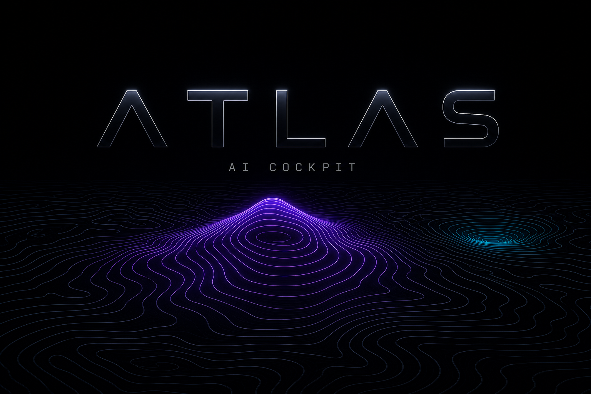
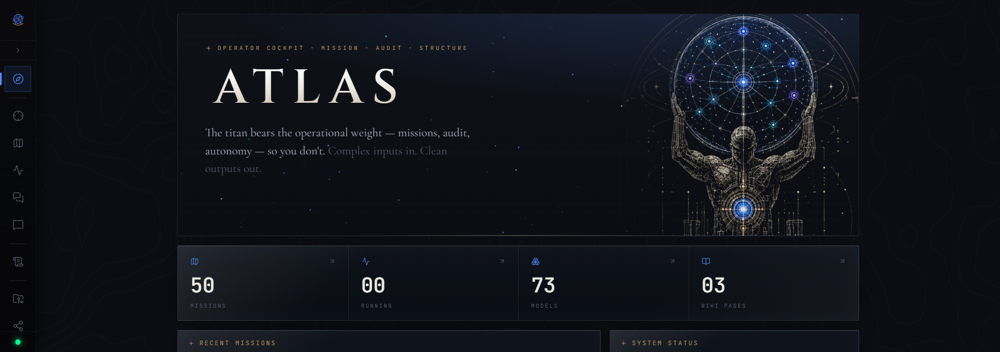
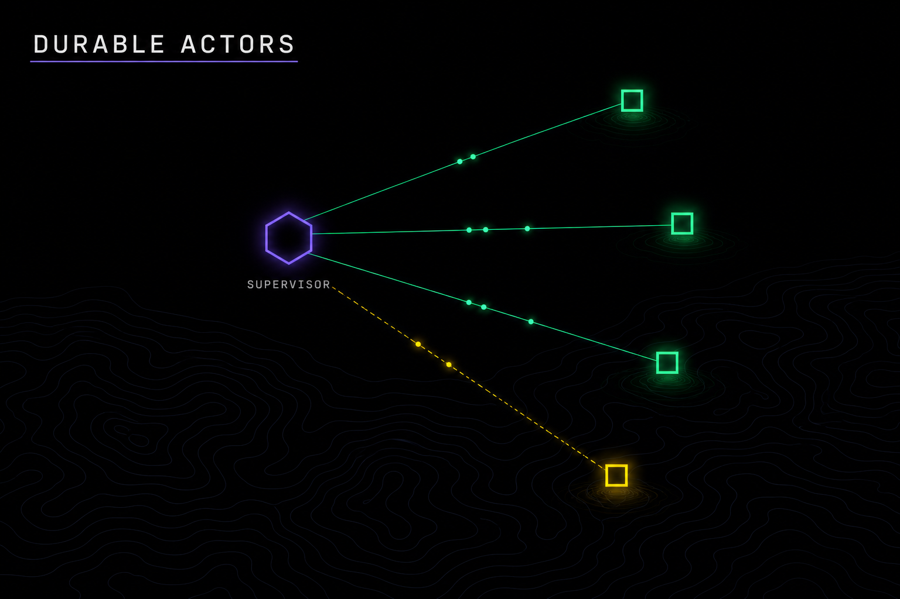
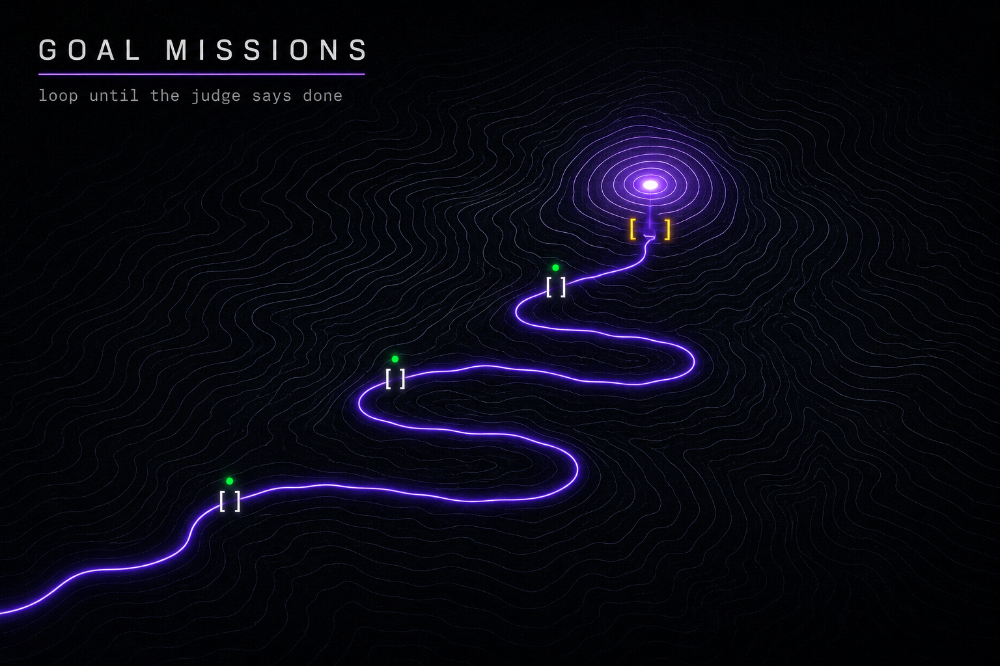
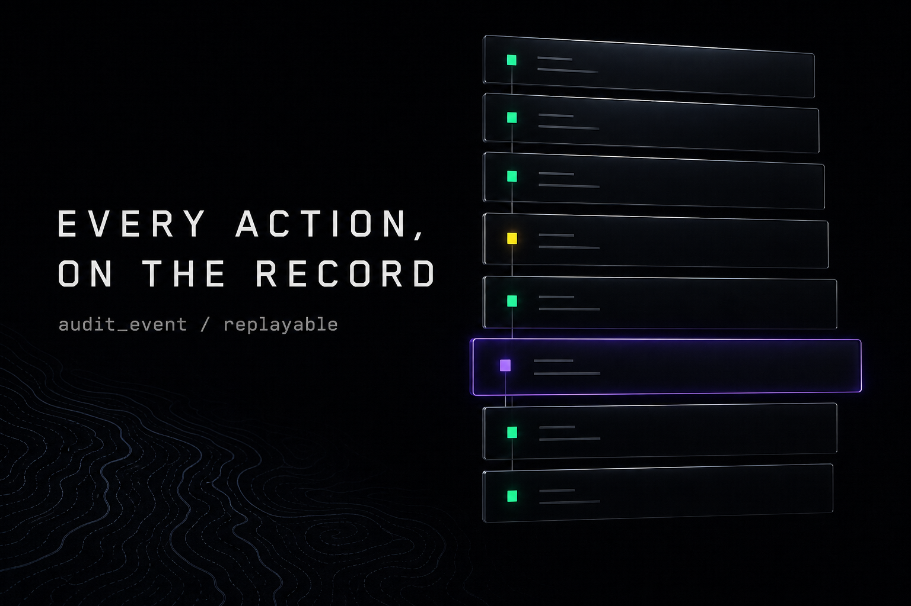
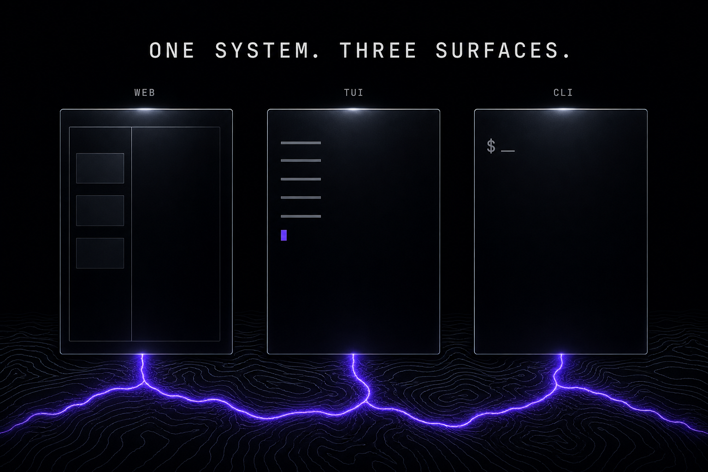
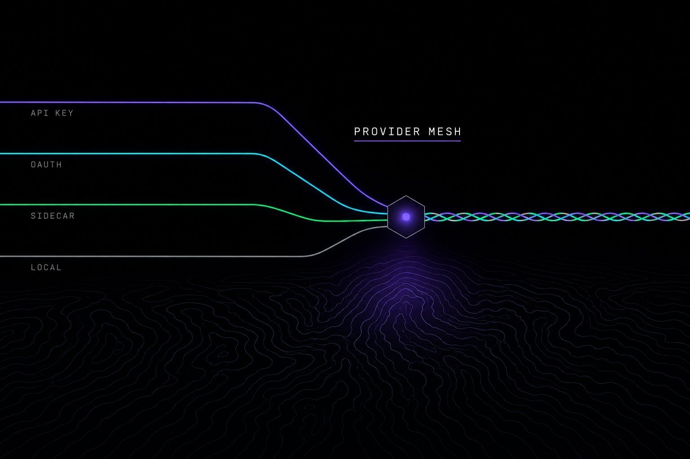
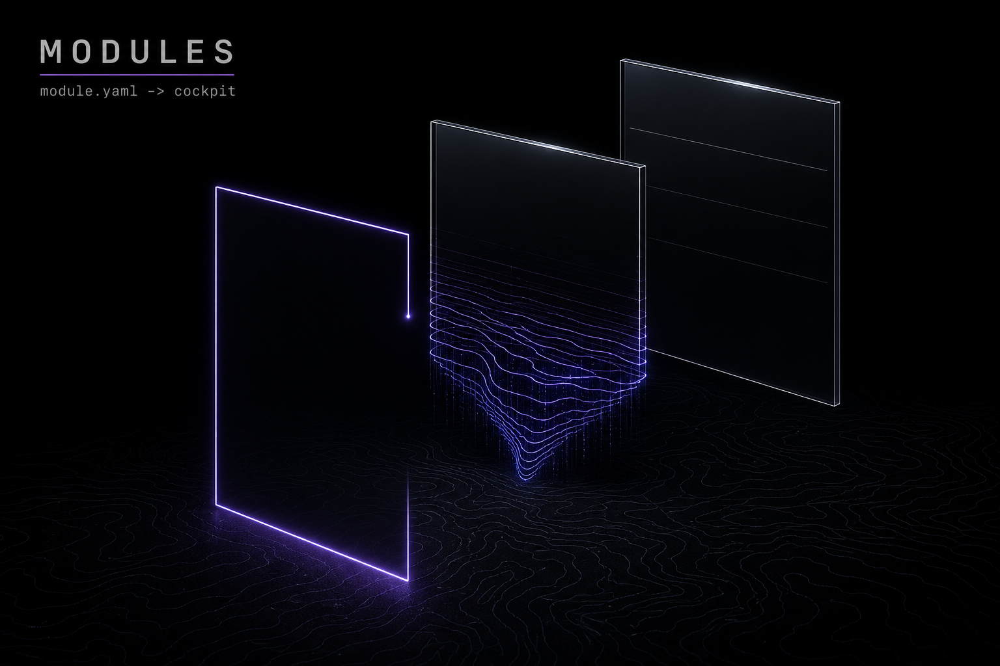
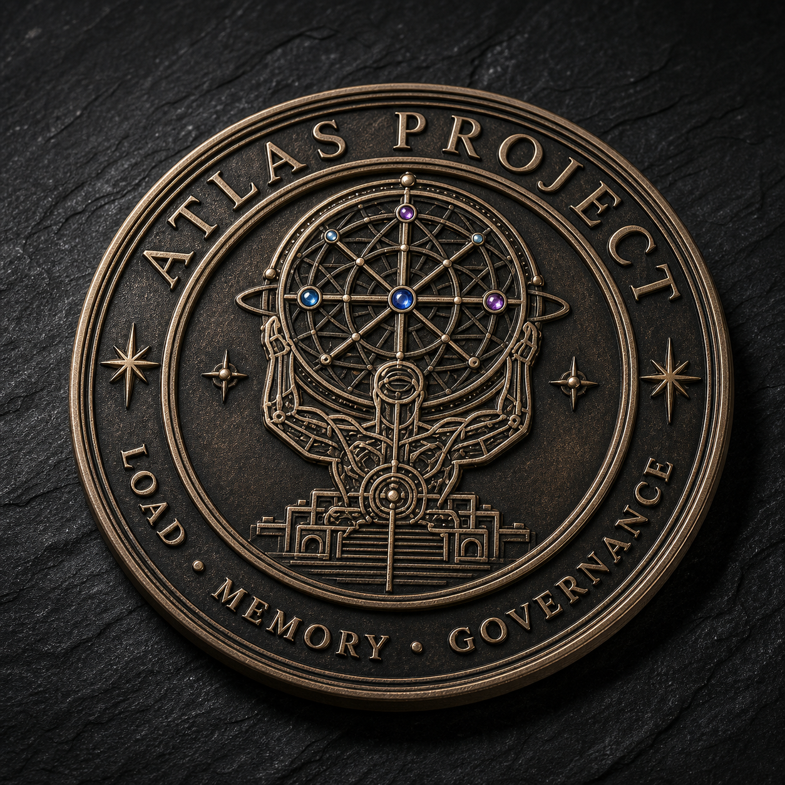

<p align="center">
  
</p>

<p align="center">
  <strong>An auditable AI operator cockpit for developers and power users.</strong><br>
  One runtime for missions, agents, tools, knowledge, approvals, and operational state.
</p>

<p align="center">
  <a href="https://www.npmjs.com/package/@systemsl2/atlas"></a>
  <a href="LICENSE"></a>
  
  <a href="../../actions/workflows/atlas-ci.yml"></a>
</p>

<p align="center">
  <a href="#installation">Install</a> ·
  <a href="docs/architecture/OVERVIEW.md">Architecture</a> ·
  <a href="docs/operations/INSTALL.md">Operations</a> ·
  <a href="docs/known-failures.md">Known limitations</a> ·
  <a href="SECURITY.md">Security</a>
</p>

```powershell
npm install --global @systemsl2/atlas
```

> **Open research preview.** The repository and Windows x64 npm package are public.
> Independent clean-machine feedback is welcome; do not use the preview with
> sensitive production data.

---

## What ATLAS is

ATLAS is a local workspace for running AI agents as part of real, organized work.
Instead of keeping your conversations, tools, tasks, files, and results in separate
places, ATLAS brings them together in one system.

You give ATLAS a goal. It can break that goal into work, use the tools you allow,
coordinate more than one agent, keep useful context between sessions, and show you
what happened. Important actions can require your approval, and ATLAS keeps a record
of the request, the action, the result, and the checks that followed.

ATLAS is built for work that lasts longer than a single chat. It is closer to an AI
operations desk than a chatbot: the chat is one way to control the system, while the
missions, saved knowledge, tools, approvals, and history continue behind it.

<p align="center">
  
</p>

## What problem it solves

Most AI tools are good at answering one message. Longer work is harder:

- the agent forgets why a decision was made;
- work is split across chats and terminal windows;
- tool calls happen without a clear review trail;
- restarting the app can interrupt an unfinished task;
- several agents can duplicate work or lose track of ownership;
- useful project knowledge stays buried in old conversations.

ATLAS gives those pieces a shared home. A mission has a goal, runs, messages,
artifacts, approvals, and a visible history. This makes it easier to continue work,
inspect a result, recover after a failure, and understand what the AI actually did.

## What ATLAS can do

- **Run goal-based missions** — Start with an outcome instead of managing every
  prompt. Missions can pause, resume, and continue until their completion checks are
  satisfied.
- **Keep conversations and work state** — Messages, runs, results, and relevant
  knowledge can survive restarts instead of disappearing with one terminal session.
- **Coordinate agents and teams** — Create focused agents, give them separate work,
  steer active work, and collect their results in one place.
- **Use tools with approval controls** — Read-only work can flow quickly while
  sensitive or changing actions can wait for an operator decision.
- **Record what happened** — ATLAS keeps an audit trail for missions, tool requests,
  approvals, outputs, failures, and verification.
- **Connect to different model providers** — Use supported cloud providers, local
  models, or operator-installed runtimes such as Codex without tying the whole system
  to one model company.
- **Build useful project memory** — Ingest documentation and notes into a searchable
  wiki and knowledge graph, with source information kept alongside the content.
- **Work from the cockpit or terminal** — The browser cockpit, terminal interface,
  and command-line tools use the same runtime and saved state.

## A simple example

Suppose you ask ATLAS to prepare a software release.

1. ATLAS creates a mission for the release outcome.
2. It reads the project state and gathers the relevant checks.
3. Separate agents can inspect tests, installation, documentation, and release files.
4. A risky action, such as publishing or deleting data, waits for approval.
5. Test results and produced files are attached to the run.
6. If the process stops, the mission can resume from saved state.
7. The ledger shows what was requested, what ran, what changed, and whether the final
   verification passed.

The same structure can support research, company operations, knowledge maintenance,
content work, or any other workflow that benefits from clear goals and traceable
actions.

## How it fits together

ATLAS has four main parts:

| Part | In plain language |
|---|---|
| Runtime | Runs missions, agents, tools, approvals, and background work |
| Saved state | Stores goals, runs, messages, configuration, and the audit history |
| Knowledge | Turns approved sources into a wiki and searchable project memory |
| Surfaces | Lets you control the same system from the browser, terminal, or scripts |

The Rust gateway handles the local API and new infrastructure. Python remains where
the Hermes-based agent and model integrations need it. The installer ships the
required runtime pieces together, so normal users do not need to assemble each part
by hand.

## Main capabilities

<table>
  <tr>
    <td width="33%" valign="top">
      
      <br><strong>Agents that survive interruptions</strong><br>
      ATLAS tracks active agents and their results so work can recover cleanly after
      a restart or process failure.
    </td>
    <td width="33%" valign="top">
      
      <br><strong>Goal-driven missions</strong><br>
      Use <code>/goal</code> to work toward an outcome with clear completion checks,
      pause and resume support, and a visible mission history.
    </td>
    <td width="33%" valign="top">
      
      <br><strong>Audit ledger</strong><br>
      Review missions, runs, tool approvals, files, results, and failures in one
      traceable record.
    </td>
  </tr>
  <tr>
    <td width="33%" valign="top">
      
      <br><strong>One system, three surfaces</strong><br>
      Use the browser cockpit, terminal interface, or scriptable CLI without creating
      three separate sources of truth.
    </td>
    <td width="33%" valign="top">
      
      <br><strong>Choice of AI providers</strong><br>
      Connect API-key, sign-in, local, and separately installed model providers.
      Optional Claude and Codex support stays separate from the base install.
    </td>
    <td width="33%" valign="top">
      
      <br><strong>Modules you can keep</strong><br>
      A module declares commands, pages, doctrine, typed records and MCP servers
      in one manifest. Yours live under <code>ATLAS_HOME/modules</code> and
      remain in place when ATLAS updates.
    </td>
  </tr>
</table>

- **Persistent knowledge** — wiki/codex ingestion, provenance, a queryable knowledge
  graph the agent can read and write, and configurable graph scopes.
- **Optional modules with real capability** — activating a module gives the agent its
  doctrine (injected into runs, budgeted), its typed records, its workflows and its
  MCP servers; deactivating retracts all of it without deleting the data. Bundled:
  GSD/L2 execution doctrine and evidence-gated Outreach.
- **Working memory that survives a reset** — the agent keeps plans, findings and
  drafts in a scratchpad with an expiry, and a run resuming the same session is handed
  them back automatically instead of re-deriving them.
- **Disposable tools, with the reason attached** — when a missing capability blocks it,
  the agent can write a bounded one-off script to an ATLAS-owned scratch directory and
  run it out of process under the normal permission rules. It cannot do so silently: it
  must state what it searched and why this is disposable, and that reasoning is recorded
  permanently even after the tool expires. It expires on the next restart unless you keep
  it; Control → Tools shows everything it is holding and why.
- **Native direction** — the gateway and new infrastructure are Rust-first; the Hermes
  plugin surface and LLM adapters remain Python where that boundary is useful.

## Who ATLAS is for

ATLAS is currently aimed at developers, technical operators, founders, researchers,
and power users who want an AI system they can inspect and control. It is especially
useful when work spans many steps, tools, agents, or sessions.

It is not yet a finished consumer assistant or a hosted service that hides every
technical detail. This is an open research preview. You should expect to review
approvals, inspect important outputs, and avoid sensitive production data until the
remaining platform and clean-machine checks are complete.

## Installation

Windows x64 preview:

```powershell
npm install --global @systemsl2/atlas
```

The npm launcher installs a verified platform release, then delegates normal commands
to it. Application versions live outside the source repository and outside live
operator state. `atlas update` replaces the launcher/runtime version while preserving
the database, configuration, credentials, wiki, logs, and user modules.

The published Windows package contains an embedded Python runtime, the Rust gateway,
terminal UI, compiled WebUI, runtime services, and bundled modules. Node.js 20+ and
npm are the only prerequisites; Git, Python, Go, and Rust are not required. Source
developers can still use the PowerShell bootstrap:

```powershell
$f="$env:TEMP\atlas-install.ps1"; (irm https://raw.githubusercontent.com/L2-ootm/L2-ATLAS-PROJECT/main/install/install.ps1) | Set-Content -Path $f -Encoding UTF8; powershell -ExecutionPolicy Bypass -File $f
```

The PowerShell URL is public and now uses the same npm release path by default. See
[the installation guide](docs/operations/INSTALL.md) for source, release, update,
rollback, and clean-machine details.

## First run

```powershell
atlas up --services gateway,cockpit
atlas doctor
atlas
```

`atlas up` starts the local gateway and cockpit. `atlas` opens the terminal surface.
Mock Mode supports the core demo path without a provider API key.

## What happens to your data

ATLAS separates the application files from your working data:

- application versions are installed in a versioned application directory;
- configuration, credentials, the database, logs, wiki content, and personal modules
  live under `ATLAS_HOME`;
- updates install and verify a new application version before switching to it;
- rollback can return to the previous verified application version;
- uninstall keeps operator state unless you explicitly request a validated purge.

ATLAS is local-first, but model providers and connected tools may send the information
needed for a request to their own services. Review each provider and tool before using
private data.

## Update model

```text
npm launcher          npm global prefix
immutable releases    OS application-data/atlas/versions/<version>
active pointer        OS application-data/atlas/current
operator state        ~/.atlas (or ATLAS_HOME)
user modules          ~/.atlas/modules
```

Updates never target this development checkout. A failed download, checksum, or
entrypoint validation cannot activate the new version; the previous verified version
remains available to `atlas rollback`.

## Repository map

| Area | Purpose |
|---|---|
| `foundation/atlas-hermes/` | Hermes-derived ATLAS foundation and divergence record |
| `services/agent-runtime/` | Runtime orchestration and CLI |
| `native/atlas-core-rs/` | Rust gateway and native infrastructure |
| `services/web-ui-react/` | WebUI operator cockpit |
| `services/atlas-tui/` | Current Go terminal surface |
| `services/atlas-terminal/` | Next terminal surface under gated evaluation |
| `packages/atlas-cli/` | npm installer, updater, rollback, and runtime launcher |
| `modules/` | Modules bundled with ATLAS releases |
| `docs/` | Architecture, operations, decisions, verification, and release material |

## Trust and project status

ATLAS is intentionally honest about unfinished work. Version `0.1.5` is public on npm
for Windows x64 and as GitHub runtime bundles for Windows x64, Linux x64, Intel macOS,
and Apple Silicon macOS. On 2026-07-29, the public npm launcher and Windows runtime
were installed again from the anonymous registry into isolated application and state
directories. The install reported `0.1.5`, every packaged-file checksum matched, and
the install-only doctor reported healthy. Linux and macOS bundles passed the automated
build and test matrix but still need independent clean-machine acceptance before they
should be treated as equally proven. Repository cleanup and the configured
full-history secret scan are complete. Release status is tracked in
[`docs/release/RELEASE_CHECKLIST.md`](docs/release/RELEASE_CHECKLIST.md); internal
planning/session state is deliberately excluded from the public repository.

The foundation is vendored and evolved in place rather than treated as a black-box
dependency. Provenance and changes are documented in
[`foundation/ATTRIBUTION.md`](foundation/ATTRIBUTION.md) and
[`foundation/DIVERGENCE_LOG.md`](foundation/DIVERGENCE_LOG.md).

## Contributing

Read [CONTRIBUTING.md](CONTRIBUTING.md), the [Code of Conduct](CODE_OF_CONDUCT.md),
and [CLA.md](CLA.md) before opening a contribution. Security issues should follow the
private process in [SECURITY.md](SECURITY.md).

## License

ATLAS is available under the [MIT License](LICENSE). Third-party licenses and derived
code attribution are documented in [THIRD_PARTY_LICENSES.md](THIRD_PARTY_LICENSES.md)
and [ATTRIBUTION.md](ATTRIBUTION.md).

<p align="center">
  
  <br>
  <sub><strong>FOR THOSE WHO BUILD WHAT ENDURES.</strong></sub>
</p>
